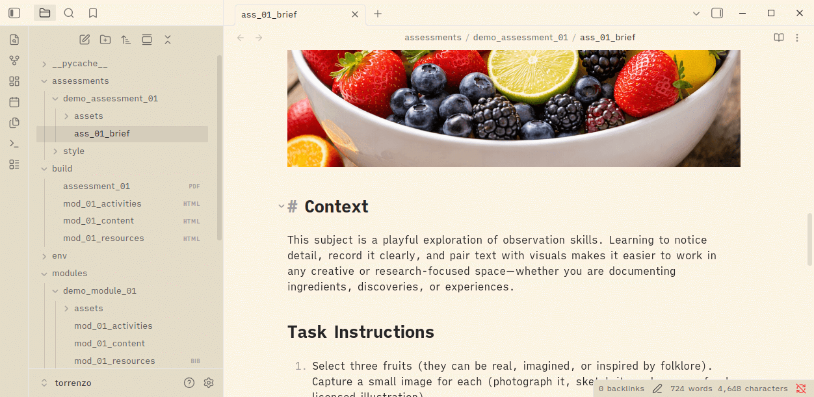

# Torrenzo

*Lightweight publishing pipeline for digital learning content*



---

## What Does It Do?

Torrenzo traverses structured learning content directories and generates LMS-ready HTML module pages and PDF assessment briefs from Markdown, BibTeX, and other source material.

Torrenzo currently performs the following transformations:

| Input                                         | Output |
|-----------------------------------------------|--------|
| `assessments/assessment_<n>/ass_<n>_brief.md` | PDF    |
| `modules/module_<n>/mod_<n>_content.md`       | HTML   |
| `modules/module_<n>/mod_<n>_activities.md`    | HTML   |
| `modules/module_<n>/mod_<n>_resources.bib`    | HTML   |

See [sample_build](sample_build) for example output artefacts generated from the demo content.

### Yeah, But Why?

Torrenzo keeps learning content **portable, readable, and version-controlled**.

Instead of authoring material directly in a learning management system (LMS), content is written in plain-text formats such as Markdown and BibTeX. This approach enables:

- **Consistent metadata** defined once and reused everywhere (e.g., learning outcomes or assessment details)
- **Version control** using Git and other standard tools
- **Clear separation** of content and presentation
- **Editor independence** so you can write with any tool (Obsidian, VS Code, Vim, even MS Word?)
- **Machine-readable materials** that automation tools and AI can analyse and update
- **Extensible components** for reusable interface elements across multiple pages
- **Adaptable open-source tooling** to extend or customise for *your* publishing workflow

---

## Usage

1. Ensure to install [prerequisites](#prerequisites).
2. [Populate subject content](#populating-content) (`outline.md`, `assessments/`, and `modules/`).
3. Run Torrenzo from the repository root using `python torrenzo.py`

By default, Torrenzo scans the current directory. To target another workspace, use: `python torrenzo.py ../other-subject`

Torrenzo outputs everything (HTML, PDF, etc.) to the `build/` directory (which is cleared at the start of each run).

> 💡 Torrenzo supports writing, organising, and navigating content in [Obsidian](https://obsidian.md), and includes an `.obsidian` configuration so that you can simply point a new vault at your Torrenzo project.

---

## Configuration & Tags

Use `outline.md` as the single source of metadata, formatted in YAML. Use [Dataview-style](https://blacksmithgu.github.io/obsidian-dataview) tags in content, for example `` `=[[outline]].assessment.a1.weighting` `` or `` `=[[outline]].slo.a` ``.

Starter keys in `outline.md`:

- **Subject:**  
  `subject.code`, `subject.title`, `subject.descriptor`
- **SLOs:**  
  map under `slo` with codes (e.g., `slo.a`)
- **Assessments:**  
  Produce a full metadata table using `assessment.a1` or `assessment.a2`, etc.

---

## Prerequisites

- **Python 3.10+**
- **Node 18+** with `npm`
- **Terminal environment** of your choice

### Working Directory
All relative paths assume execution from the repository root. Set your working directory using:
```bash
cd <repository-root>
```

### Python Setup
To create and activate a virtual environment, then install dependencies:
```bash
python3 -m venv env
source env/bin/activate
pip install -r requirements.txt
```

### Node Setup
Required for PDF generation via `md-to-pdf`. To install Node dependencies locally:
```bash
npm install
```

---

## Repository Architecture

Torrenzo provides a ready-to-use structure for a single subject. The project is intentionally filesystem-driven: file names and directory structure determine how Torrenzo processes content.

Any `demo_`-prefixed items are included for illustration. You can delete them if you wish; otherwise they build normally and appear in the `build/` output.

```text
subject-root/
├── assessments/        # assessment briefs → PDF
│   ├── demo_assessment_1/
│   │   ├── ass_1_brief.md
│   │   └── assets/
│   ├── assessment_<n>/
│   │   ├── ass_<n>_brief.md
│   │   └── assets/
│   └── ...
├── modules/            # module content → HTML
│   ├── demo_module_1/
│   │   ├── mod_1_content.md
│   │   ├── mod_1_activities.md
│   │   └── assets/
│   ├── module_<n>/
│   │   ├── mod_<n>_content.md
│   │   ├── mod_<n>_activities.md
│   │   └── assets/
│   └── ...
├── build/              # generated output
├── outline.md          # subject configuration (YAML)
├── references.bib      # global references (BibTeX)
└── torrenzo.py         # run to build
```

### Populating Content

Subject content lives in two directories -- `assessments/` and `modules/`. Torrenzo relies on strict naming conventions in these directories to locate and process files.

- **Define global metadata** in `outline.md` (using YAML). Torrenzo injects these values wherever placeholders such as `` `=[[outline]].subject.title` `` appear in source Markdown files.

- **Define assessment briefs** in `assessments/assessment_<n>/ass_<n>_brief.md`. Place any assets the brief references (images, etc.) in the adjacent `assets/` directory.

- **Store reference sources** in `references.bib`. This file uses *BibTeX format*; in-text citations use the `@refname` syntax. Torrenzo renders the corresponding references at the bottom of the page.

- **Organise module files** using the same pattern under `modules/module_<n>/`. Each module contains:
  - `mod_<n>_content.md` -- primary module content page(s)
  - `mod_<n>_activities.md` -- activity page(s)
  - `assets/` -- supporting files (images, etc.) used within the module

> 💡 For multiple content or activity pages, add a suffix to the file name. For example: `mod_01_content_01.md`, `mod_01_content_02.md`, or `mod_01_activities_foo.md`, `mod_01_activities_bar.md`.

During the build process, Torrenzo reads metadata from `outline.md` (SLOs, etc.) and converts source content into:

- PDF assessment briefs
- LMS-ready HTML module pages (including separate activity pages)

Torrenzo writes all output to `build/`.

When processing demo inputs, Torrenzo adds a `demo_` filename prefix. For non-demo inputs, it keeps the original base names. Torrenzo clears and regenerates the `build/` directory on each run.

### Module Styling

An optional global stylesheet lives at `modules/style/style.css`. Its rules are inlined into HTML output so styling survives LMS copy-paste without requiring additional stylesheets in the target LMS.

### Assessment Branding

Universal assessment branding assets live in `assessments/style/`. On each run, the build injects `logo.svg` into the PDF header. Replace `logo.svg` (must be an SVG) to use a different logo, and configure styling and header/footer elements via the `style.css` and `config.js`.

---

## Technical Stuff

This section is intended for developers and contributors.

### Transformers

Torrenzo uses a plugin-style architecture with an extensible set of transformers:

| Transformer                                | Conversion      |
|--------------------------------------------|-----------------|
| `torrenzo_engine/renderers/bib_to_html.py` | BibTeX → HTML   |
| `torrenzo_engine/renderers/md_to_html.py`  | Markdown → HTML |
| `torrenzo_engine/renderers/md_to_pdf.py`   | Markdown → PDF  |

Torrenzo supports additional transformers without modifying the core pipeline. Developers should extend it to new targets (e.g., Marp slides or Word documents) without expanding the CLI driver. Potential candidates include:

- `.docx` → HTML (using predefined Word stylesheets to ensure consistent visual output and semantic structure)
- Marp `.md` → PDF (slide decks)
- Extended Markdown features for module pages (accordions, navigation tabs, and other LMS-specific markup)

---

## To-Do

- [ ] Determine whether Canvas Files can be linked to directly (e.g., images or file paths).
- [x] Match Obsidian's (Dataview) tag syntax to better support WYSIWYG-style editing workflows
- [ ] Refine CSS styles for assessment briefs
- [x] Improve brief templates (page numbers, versioning in headers, etc.)
- [ ] Capture and expose build diagnostics (missing placeholders, missing assets, invalid front matter, failed conversions)
- [ ] Consolidate on Python (or Node?) to maintain a single dependency stack
- [ ] Configure GitHub Actions to build cross-platform executables (Windows/macOS/Linux).
- [ ] ...

### 'Maybe' Goals

- [ ] Build Obsidian extension/plugin to support workflow (configuration, build, etc.)
- [ ] Add support for Word documents (via semantic styles)
- [ ] Add support for Marp slide decks
- [ ] Implement batch LMS content importer (via Tampermonkey or similar)
- [ ] ...

