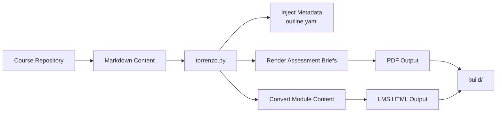
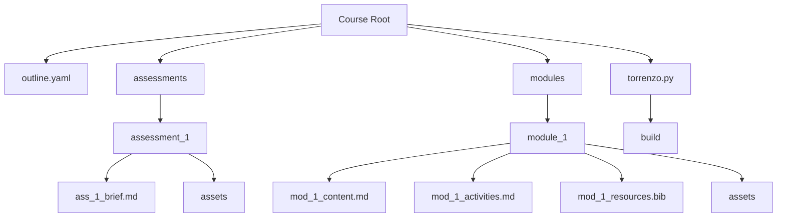

# Torrenzo

> **Torrenzo** converts structured Markdown learning content into LMS-ready HTML and printable assessment briefs.

A content transformer that serves as a lightweight publishing pipeline for digital learning content. It traverses a structured course directory and generates LMS-ready materials and assessment briefs.

Torrenzo performs the following transformations:

1. Renders each `assessments/assessment_<n>/ass_<n>_brief.md` into a **PDF**
2. Converts `modules/module_<n>/mod_<n>_content.md` into LMS-ready **HTML**
3. Converts `modules/module_<n>/mod_<n>_activities.md` into LMS-ready **HTML**
4. Converts `modules/module_<n>/mod_<n>_resources.bib` into LMS-ready **HTML**

These transformations rely on configuration defined in `outline.yaml`, which provides metadata such as:

- **`subject_descriptor`** – A short overview of the subject, including its aims, key concepts, and the knowledge and skills students are expected to gain.
- **`slo > code: <n>`** – The specific knowledge, skills, and capabilities students should be able to demonstrate upon successful completion of the subject.
- **`assessment_metadata`** – An overview of each assessment task, including its format, purpose, and submission requirements.

---

## Diagrams

### Content pipeline



### Repository architecture



Torrenzo treats course content as a structured repository. Markdown files contain the primary content, while `outline.yaml` provides subject metadata.

During the build process, Torrenzo injects metadata and transforms content into:

- PDF assessment briefs  
- LMS-ready HTML module content  
- HTML resource lists  

All outputs are written to the `build/` directory.

---

## Prerequisites

- **Python 3.10+**
- Dependencies installed via:

```bash
pip install -r requirements.txt
```

- A terminal located at the repository root (relative paths are resolved from there)

*(A GUI may be added in the future.)*

---

## Repository structure

- `torrenzo.py` — CLI driver that orchestrates build preparation, metadata injection, PDF generation, and HTML conversion
- `outline.yaml` — Metadata source used to populate learning outcomes and other subject information in generated outputs
- `assessments/` — Contains assessment briefs in `assessment_<n>/ass_<n>_brief.md`, along with assets referenced by the briefs
- `modules/` — Contains module content and activities in `module_<n>/`
- `build/` — Generated PDFs and HTML fragments (deleted and recreated on every run)

> If you have a plugin-style architecture implemented, you may also have:
>
> - `torrenzo/pipeline.py` — Job discovery and execution
> - `torrenzo/renderers/` — Renderer implementations (`md_to_pdf`, `md_to_html`, etc.)

---

## Usage

1. Ensure prerequisites are installed.
2. Populate course content (`outline.yaml`, `assessments/`, and `modules/`).
3. Run Torrenzo from the repository root:

```bash
python torrenzo.py
```

By default, Torrenzo scans the current directory. To target another workspace:

```bash
python torrenzo.py ../other-subject
```

All outputs (HTML, PDF, etc.) are written to the `build/` directory, which is cleared at the start of each run.

---

## Configuration & styling

- Maintain subject metadata in `outline.yaml`. Torrenzo injects values wherever placeholders such as `{{slo}}` appear.
- The CSS in `assessments/style.css` controls the styling of generated PDF briefs.

---

## Renderer pipeline (plugin architecture)

Torrenzo’s build process can be modelled as a set of **render jobs**:

- a file pattern (input)
- an output location
- a renderer responsible for the transformation
- a shared metadata context (from `outline.yaml`)

This makes it easy to extend Torrenzo with new targets (e.g., Marp slides, DOCX, quizzes) without inflating the CLI driver.

### Example build targets

```yaml
build_targets:
  - name: assessment_briefs
    input: "assessments/assessment_*/ass_*_brief.md"
    output_dir: "build/assessments"
    renderer: "md_to_pdf"

  - name: module_content
    input: "modules/module_*/mod_*_content.md"
    output_dir: "build/modules"
    renderer: "md_to_html"

  - name: module_activities
    input: "modules/module_*/mod_*_activities.md"
    output_dir: "build/modules"
    renderer: "md_to_html"

  - name: module_resources
    input: "modules/module_*/mod_*_resources.bib"
    output_dir: "build/modules"
    renderer: "bib_to_html"
```

### Diagnostics

Renderers should ideally report consistent diagnostics such as:

- missing placeholders / metadata keys
- missing assets referenced by Markdown
- invalid Markdown front matter / schema issues
- failed conversions (with file + reason)

---

## TODO

- [ ] Refine CSS styles for assessment briefs
- [ ] Improve brief templates (page numbers, versioning in headers, etc.)
- [ ] Capture and expose build diagnostics (invalid Markdown front matter, missing metadata)
- [ ] Build a GUI (desktop or web interface)
- [ ] Add support for Word documents (via semantic styles)
- [ ] Add support for Marp slide decks
- [ ] Implement batch LMS content importer (via Tampermonkey or similar)

