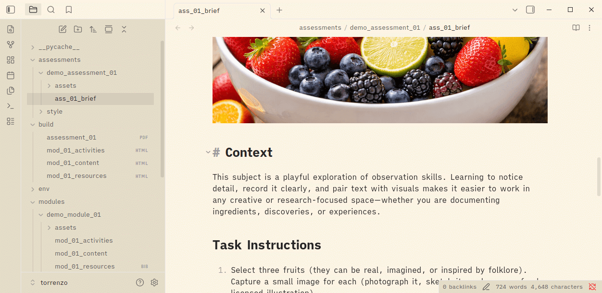
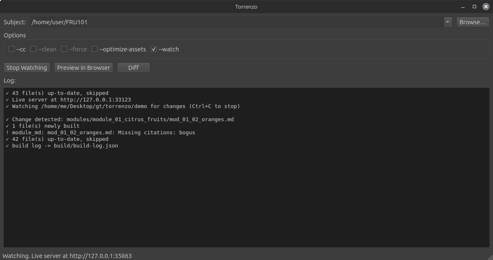

# Torrenzo

*Lightweight publishing pipeline for digital learning content*

---

  
*Image: Editing a Torrenzo project using Obsidian for Markdown support. You can use any editor you prefer, including MS Word, with potential to support other formats in future.*

---

**Think: static-site-generator-style workflow for publishing to LMS platforms.**

---

## Table of Contents

- [What Does It Do?](#what-does-it-do)
- [Usage: GUI](#usage-gui)
- [Usage: Command-Line Interface (CLI)](#usage-command-line-interface-cli)
- [Usage: Build Options (GUI & CLI)](#usage-build-options-gui--cli)
- [Configuration & Tags](#configuration--tags)
- [Prerequisites](#prerequisites)
- [Populating Content](#populating-content)
- [Technical Stuff](#technical-stuff)

---

## What Does It Do?

Torrenzo traverses structured learning content directories and generates LMS-ready HTML module pages and PDF assessment briefs from Markdown, BibTeX, and other source material.

Torrenzo currently performs the following transformations:

| Input                                          | Output |
|------------------------------------------------|--------|
| `assessments/assessment_<n>/ass_<n>_brief.md`  | PDF    |
| `modules/module_<n>/mod_<n>_<seq>_<name>.md`   | HTML   |
| `modules/module_<n>/mod_<n>_<seq>_<name>.docx` | HTML   |

See the [`demo/`](demo) directory for sample subject content, and [`demo/build/`](demo/build/) for example output artefacts.

### Yeah, But Why?

Torrenzo keeps learning content **portable, readable, and version-controlled**.

Instead of authoring material directly in a learning management system (LMS), content is written in semantic, plain-text formats such as Markdown and BibTeX. This approach enables:

- **Consistent metadata** defined once and reused everywhere (e.g., learning outcomes or assessment details)
- **Version control** using Git and other standard tools
- **Clear separation** of content and presentation
- **Editor independence** so you can write with any tool (Obsidian, VS Code, Vim, even MS Word + Styles)
- **Machine-readable materials** that automation tools and AI can locally analyse and update
- **Extensible components** for reusable interface elements across multiple pages
- **Adaptable open-source tooling** to extend or customise for *your* publishing workflow

---

## Usage: GUI

Torrenzo includes a desktop application for point-and-click builds.


*Image: The Torrenzo GUI running on Linux. The GUI is available for Linux, macOS, and Windows.*

**Features:**

- **Directory picker** with history (remembers your subject folders)
- **Build options** as checkboxes
- **Live build log** displayed in the window
- **Preview in Browser** button opens the build output for review (with live-reload for `--watch` mode)
- **Watch mode** checkbox monitors source files and rebuilds automatically on change
- **Diff** button compares the local cartridge against a live Canvas export

The Diff feature allows you to compare your active project against an exported Canvas file. This is especially helpful when you need to be selective about updating content, as importing a massive cartridge for every minor tweak can be inefficient, messy, or even restricted by institutional permissions. Diff groups results into three categories:

| Category                  | Marker | Description                                                                 |
|---------------------------|--------|-----------------------------------------------------------------------------|
| **CHANGES**               | `*`    | Content, points, or checksum differences                                    |
| **LIVE-ONLY**             | `−`    | Items not in local build (prefixed `(wikipage)`, `(assessment)`, `(asset)`) |
| **REBUILT, SAME CONTENT** | `→`    | PDFs re-rendered but identical after stripping timestamps                   |

Additional live-only Canvas artifacts (LTI links, QTI quizzes, course image) appear under LIVE-ONLY with a `•` bullet. You can jump to [more technical info on Diff's workings](#more-on-diffs-workings)

Launch the GUI using one of the following methods:

- Prebuilt binary from the Releases page: https://github.com/tabreturn/torrenzo/releases
- From source (repo root): `python -m torrenzo_gui` (ensure to install [prerequisites](#prerequisites) first)

> 💡 To start working on a Torrenzo project, it's easiest to [use the demo as a scaffold](https://download-directory.github.io/?url=https%3A%2F%2Fgithub.com%2Ftabreturn%2Ftorrenzo%2Ftree%2Fmain%2Fdemo), launch the GUI, and run a build to explore how everything works.

---

## Usage: Command-Line Interface (CLI)

1. Ensure to install [prerequisites](#prerequisites).
2. [Populate subject content](#populating-content) (`outline.md` or `outline.yaml`, `assessments/`, and `modules/`).
3. Run Torrenzo from the repository root, passing your subject directory:

```bash
python -m torrenzo /path/to/your-subject
```

`outline.[md|yaml]`, `assessments/`, `modules/`, and `build/` all resolve relative to the subject root. Torrenzo outputs everything (HTML, PDF, etc.) to `build/` inside the subject directory. Only files whose sources have changed since the last build are regenerated; orphaned outputs are removed automatically. Use build options to override/control this behaviour.

---

## Usage: Build Options (GUI & CLI)

- By default, Torrenzo skips files whose outputs are already newer than their sources. Use `--force` to rebuild everything regardless, or `--clean` to wipe `build/` first and then do a full rebuild.

- Use `--optimize-assets` to optimise graphic assets. SVG optimisation uses the system `scour` CLI tool (`pip install scour`); PNG optimisation requires `pngquant` or `oxipng` installed on your system.

- Use `--cc` to output a [Common Cartridge](#common-cartridge-imscc) file for bulk-importing Canvas content.

* Use `--watch` to monitor source files and rebuild them incrementally upon saving. In the GUI, ticking the **--watch** checkbox additionally retargets **Preview in Browser** to a live reload server that automatically refreshes the browser preview after each rebuild. For the CLI, use `--live` (which implies `--watch`) to start this HTTP server.

- Use the **Diff** button (GUI) or `--diff LOCAL.imscc LIVE.imscc` (CLI) to [compare two cartridges](#diffing-against-a-live-course-export) and see what would change on import. This is useful when you want to apply targeted updates using the Canvas editor rather than importing an entire Common Cartridge.

- Use `--cache-bust` to append a cache-busting suffix to any `/assets` filenames and their HTML references. This works around an intermittent Canvas issue where previously uploaded images stop rendering after a course re-import (I'm not sure why). Provide a custom tag or omit it for an auto-generated daily stamp.

> 💡 Each build writes (or appends to) `build/build-log.json` listing newly built files with timestamps. This provides one way to identify which files need updating in your LMS across multiple builds.

---

## Configuration & Tags

Use `outline.[md|yaml]` as the single source of metadata, formatted in YAML. Use [Dataview-style](https://blacksmithgu.github.io/obsidian-dataview) tags in content, for example `` `=[[outline]].assessment.a1.weighting` `` or `` `=[[outline]].slo.a` ``

Alternatively, you can also just use the bare form without backticks or equals sign: `[[outline]].assessment.a1.weighting` or `[[outline]].slo.a`. Note, however, that the bare form won't render as a live preview in Obsidian.

Keys in `outline.[md|yaml]` define your subject metadata and automatically populate across all content via tags/placeholders.

- **Subject:**  
  `subject.code`, `subject.title`, `subject.descriptor`
- **SLOs:**  
  Map under `slo` with codes (e.g., `slo.a`)
- **Assessments:**  
  Produce a full metadata table using `assessment.a1` or `assessment.a2`, etc.

### Wiki Links

Use wiki-style `[[...]]` syntax to create links between modules and assessments. Torrenzo automatically derives the display label unless you explicitly provide one using a `|` character.

| Syntax                               | Renders as                                      |
|--------------------------------------|-------------------------------------------------|
| `[[mod_01_02_oranges]]`              | `[Module 1.2: Oranges](mod_01_02_oranges.html)` |
| `[[mod_01_02_oranges\|Oranges]]`     | `[Oranges](mod_01_02_oranges.html)`             |
| `[[mod_02_02_mangoes\|Mangoes]]`     | `[Mangoes](mod_02_02_mangoes.html)`             |
| `[[assessment_01]]`                  | `[Assessment 1](assessment_01.html)`            |
| `[[assessment_01\|Brief]]`           | `[Brief](assessment_01.html)`                   |

Wiki links expand before Markdown rendering and before Common Cartridge export, so they work in the browser preview. However, *Assessment* link targets won't preview as those pages are built for the cartridge only.

> 💡 Wiki links (`[[...]]`) are syntactic sugar, and regular Markdown links like `[Mangoes](../module_02/mod_02_02_mangoes.md)` work too -- the build rewrites `.md` to `.html` automatically. Use raw  `<a href="path.md">` if you must retain the `.md` extension.

### Image Sizing

Images support optional Gemini-style CSS directives after a pipe (`|`), inlining styling on the resulting `` element:

```markdown

```

Output: ``

### Includes

Use `[[includes|filename]]` to inline reusable content from the `includes/` directory. The included file's content resolves before tag processing, so includes can themselves contain tags and wiki links.

```markdown
[[includes|referencing.md]]
```

Includes resolve from `{subject_root}/includes/`, available to both assessments and modules. Changes to files in `includes/` trigger automatic rebuilds.

### Components

Torrenzo includes built-in components for common page elements. Components use the bare `[[...]]` form (no backticks or equals sign):

| Tag                                | Description                                      |
|------------------------------------|--------------------------------------------------|
| `[[component.module-navigation]]`  | Tabbed navigation linking to sibling sub-modules |

---

## Prerequisites
*(to run Torrenzo or launch the GUI via CLI)*

- **Python 3.9+**
- **Google Chrome or Chromium** (for PDF generation)
- **Terminal environment** of your choice

### Setup
Clone or [download](https://github.com/tabreturn/torrenzo/archive/refs/heads/main.zip) the Torrenzo repository. All setup commands run from the **Torrenzo repo root** -- subject content typically lives separately (although the repo includes a `demo`).

To create and activate a virtual environment, then install dependencies:
```bash
python3 -m venv env
source env/bin/activate
pip install -r requirements.txt
```

> 💡 Running the GUI from the CLI is useful when you don't have administrative privileges on your computer (but already have Python).

> 💡 PDF generation uses your system's Chrome/Chromium. If Chrome is installed in a non-standard location, set the `PUPPETEER_EXECUTABLE_PATH` environment variable (e.g., `export PUPPETEER_EXECUTABLE_PATH=/path/to/chrome`).

---

## Populating Content

The tool is filesystem-driven: file names and directory structure determine how content is processed.

**Subject directory layout:**
```text
your-subject/
├── assessments/        # assessment briefs → PDF
│   ├── assessment_<n>/
│   │   ├── ass_<n>_brief.md
│   │   └── assets/
│   └── style/          # branding (logo.svg, style.css, config.js)
├── includes/           # reusable content snippets (inlined via [[includes|...]])
│   └── *.md
├── modules/            # module content → HTML
│   ├── module_00/      # overview / introductory content (landing page)
│   │   ├── mod_00_<seq>_<name>.[md|docx]
│   │   └── assets/
│   ├── module_<n>/
│   │   ├── mod_<n>_<seq>_<name>.[md|docx]
│   │   └── assets/
│   ├── style/          # stylesheet inlined into HTML output
│   └── references.bib  # subject-level BibTeX references
├── notes/              # lecturer-only notes (copied as-is, unpublished)
│   └── *.md (or any format)
├── build/              # generated output
│   └── ...
└── outline.[md|yaml]   # subject configuration (YAML)
```

During the build process, Torrenzo reads metadata from `outline.[md|yaml]` (SLOs, etc.) and converts source content into:

- PDF assessment briefs
- LMS-ready HTML module pages (including separate activity pages)

> 💡 To get started, you could simply duplicate the `demo/` subject, rename it, perhaps move it, and use it as a starting point for developing new learning materials.

Subject content lives in two directories -- `assessments/` and `modules/`. Torrenzo relies on strict naming conventions to locate and process files.

- **Define global metadata** in `outline.[md|yaml]` (using YAML). Torrenzo injects these values wherever placeholders such as `` `=[[outline]].subject.title` `` appear in source Markdown or Word files.

- **Define assessment briefs** in `assessments/assessment_<n>/ass_<n>_brief.md`. Place any assets the brief references (images, etc.) in the adjacent `assets/` directory. Note that Torrenzo will only process Markdown (not Word briefs).

- **Store reference sources** in `references.bib`. This file uses *BibTeX format*; in-text citations use the `[@refname]` syntax. Torrenzo renders the corresponding references at the bottom of the page.

- **Organise module files** using the same pattern under `modules/module_<n>/`. Each module contains:
  - `mod_<n>_<seq>_<name>.[md|docx]` -- module page(s) (content and activities)
  - `assets/` -- supporting files (images, etc.) used within the module
  - Note that Torrenzo extracts images from Word documents, so there is no need to place Word graphics in `assets/`

Use `modules/module_00/` for subject overview and introductory content (e.g., welcome page, student expectations, key documents). This typically serves as the landing page(s) content.

> 💡 Module files follow the pattern `mod_<module_num>_<seq>_<name>.<ext>`. For example: `mod_01_01_introduction.md`, `mod_01_02_oranges.md`, or `mod_01_03_activities.md`. **Module folders** accept an optional label suffix: `module_01_citrus_fruits/` becomes "Module 1 – Citrus Fruits" in the cartridge instead of "Module 1".

> 💡 Torrenzo supports writing, organising, and navigating content in [Obsidian](https://obsidian.md). The `demo/` subject includes an `.obsidian` configuration that you can copy to any working subject root -- then point a new vault at your subject directory to use it.

Torrenzo writes all output to `build/`. Module assets copy to `build/modules_html/assets`

### Lecturer Notes

Place lecturer-only materials (teaching notes, facilitation guides, etc.) in `notes/`. These files copy to `build/lecturer_notes/` retaining their original format -- no conversion applies (`.md` stays `.md`, `.docx` stays `.docx`, and so forth). When exporting a Common Cartridge (via `--cc`), lecturer notes end up in the `.imscc` package under an **unpublished** module, hidden from students.

### Module Styling & Assessment Branding

An optional global stylesheet lives at `modules/style/style.css`. Its inlines CSS into HTML output so styling survives LMS copy-paste and cartidge imports without requiring additional stylesheets in the target LMS.

Universal assessment branding assets live in `assessments/style/`. On each run, the build injects `logo.svg` into the PDF header. Replace `logo.svg` (must be an SVG) to use a different logo, and configure styling and header/footer elements via the `style.css` and `config.js`

> 💡 Each stylesheet and `config.js` includes a metadata block at the top (`Theme`, `Output`, `Version`, `Modified`). It's best practice to update these when you customise styles, so theming is easier to track across projects.

---

## Technical Stuff

This section is intended for developers and contributors.

### Transformers

Torrenzo uses a plugin-style architecture with an extensible set of transformers:

| Transformer                                          | Conversion      |
|------------------------------------------------------|-----------------|
| `torrenzo/torrenzo_engine/renderers/bib_to_html.py`  | BibTeX → HTML   |
| `torrenzo/torrenzo_engine/renderers/docx_to_html.py` | MS Word → HTML  |
| `torrenzo/torrenzo_engine/renderers/md_to_html.py`   | Markdown → HTML |
| `torrenzo/torrenzo_engine/renderers/md_to_pdf.py`    | Markdown → PDF  |

> 💡 MS Word is not a priority source format, so it has received comparatively little attention. As a matter of preference, the Torrenzo contributor(s) work exclusively in Markdown. While `modules` content can handle Word documents, `assessments` support is limited to Markdown, as Word-formatted PDF briefs require manual exporting to ensure formatting accuracy.

Torrenzo supports additional transformers without modifying the core pipeline. Developers should extend it to new targets (e.g., Marp slides) without expanding the CLI driver. Potential candidates include:

- Marp `.md` → PDF (slide decks)
- Extended Markdown features for module pages (accordions, navigation tabs, and other LMS-specific markup)
- Really, the limit is your imagination and whatever an LMS can handle ...

### Common Cartridge (.imscc)

Pass `--cc` to generate an **IMS Common Cartridge** package alongside the normal build output. The `.imscc` file bundles all module pages as Canvas WikiPages (with inter-page navigation and asset paths rewritten to Canvas's `$WIKI_REFERENCE$` / `$IMS-CC-FILEBASE$` tokens).

**Importing into Canvas:**

1. Navigate to the target course and select **Settings → Import Course Content**.
2. Set *Content Type* to **Common Cartridge 1.x Package**, choose the `.imscc` file, and click **Import**.
3. Canvas will prompt you to select *All content* or *Specific content*. Importing all content populates:
    - **Modules** -- Grouped, numbered modules containing related pages; assessments appear in a separate *Assessments* module.
    - **Pages** -- All module pages appear as WikiPages. The first page in `Module_00` includes a `front_page` meta tag, though you may need to set it manually in Canvas via *Pages → View All Pages → ⁝ → Use as Front Page*.
    - **Assignments** -- A submission point with its total marks, weighting, and configured rubric (parsed from the ***last table*** in the brief markdown).
    - **Files** -- assessment PDFs and image assets uploaded to course *Files*.
    - **Lecturer Notes** -- Lecturer-only materials set to `unpublished` (hidden from students); notes retain their original format.

Additionally, any heading in the brief tagged with `[[cc-section]]` (at any level) is rendered below the inline PDF, with its full branch of sub-sections and content included. Links to files in the assessment's `assets/` directory (e.g. `[exemplar.zip](assets/exemplar.zip)`) will work as downloadable links in the Canvas HTML.

> 💡 Observation note: When importing cartridges into Canvas, module content is overwritten *unless* it has been modified in the Canvas editor. However, assets may be duplicated during the process. Recommended approach: before bulk importing, delete all items in **Files** (in Canvas), except for the `course_image` folder.

### Diffing Against a Live Course Export via CLI

Pass `--diff` to compare two `.imscc` files -- typically your local build against a Canvas export:

```bash
python -m torrenzo demo --diff build/FRU101.imscc canvas-export.imscc
```

To generate a log, redirect output to a file using `> diff.log` (or preffered filename).

### More on Diff's workings

- WikiPages compared by normalized body content 
  (Normalizes away all: HTML entities, inline styles, GUIDs, attribute ordering, and Canvas-specific formatting)
- Assessment PDFs compared by text-content checksum with build timestamps/versions stripped
- Other assets (SVGs, images) compared by SHA-256 checksum
- File rename quirks (from Canvas import-export roundtrips) handled automatically

> 💡 Use `--diff-verbose` to see full content diffs for modified WikiPages.
