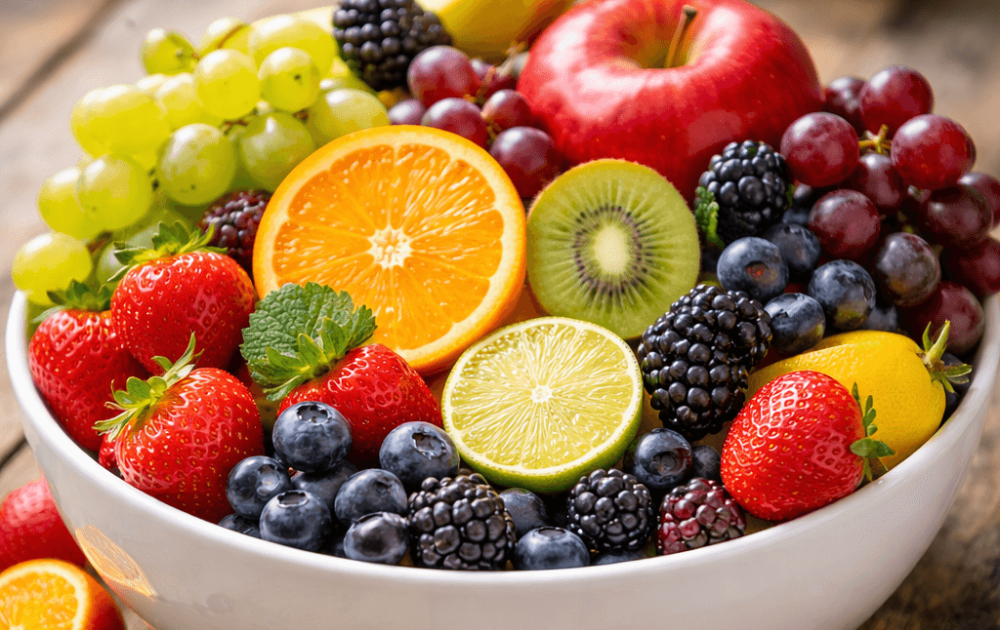

# Assessment 1 Brief: `=[[outline]].assessment.a1.assessment`

=[[outline]].assessment.a1 <!-- renders as a table because a1 is an object with nested fields -->

## Task Summary

Gather sensory impressions and create a simple catalogue entry for three tropical fruits. Each entry should combine short descriptive text with a thumbnail image (photograph, drawing, or clip-art) and note any notable traits (aroma, sweetness, texture, or provenance).

---

## Context

This subject is a playful exploration of observation skills. Learning to notice detail, record it clearly, and pair text with visuals makes it easier to work in any creative or research-focused space -- whether you are documenting ingredients, discoveries, or experiences.



---

## Task Instructions

1. Select three fruits (they can be real, imagined, or inspired by folklore). Capture a small image for each (photograph it, sketch it, or borrow a freely licensed illustration).
2. Write a few sentences per fruit that describe its look, scent, flavour, or how it might be used. Keep sentences short, clear, and upbeat.
3. Lay out the text and images in a single Markdown document (`catalogue.md`) that would also render cleanly as plain HTML. Embed the images using relative paths. Provide captions for each image.
4. Create a second file (`reflection.md`) that briefly explains your choices, what you enjoyed noticing, and how you might present the same fruit stories in another medium (poster, short video, audio guide, etc.).
5. Bundle both Markdown files plus the image assets into a folder named `assessment_01_output` and export it as a ZIP when submitting.

---

## Submission Instructions

Upload the ZIP to the LMS submission portal, and place a short README inside the archive that lists the files included, the sources of the images (if not original), and one sentence about what you learned from the exercise.

---

## Referencing

There is no formal referencing style required for this playful assessment. But please acknowledge any sourced images or borrowed descriptors directly in the README or as small captions in the catalogue.

### README Sample

```
Files Included
- catalogue.md — Markdown catalogue containing three fruit entries
- reflection.md — short reflection about the exercise
- assets/ — folder containing the fruit images used in the catalogue
  - mango.png
  - dragonfruit.png
  - rambutan.png

Image Sources
- mango.png photographed by the author
- dragonfruit.png illustration adapted from a public domain image on Wikimedia Commons
- rambutan.png from Unsplash (https://unsplash.com)

What I Learned
This exercise helped me practice observing small sensory details and describing them clearly while pairing text with simple images.
```

---


## Academic Integrity Declaration

I declare that, except where I have referenced, the work I am submitting is my own. I have kept notes on the sources I used and can share them if required.

<div class="page-break"></div> <!-- forced page break -->

## Assessment Rubric

| Assessment Attributes | Fail 0–49% | Pass 50–64% | Credit 65–74% | Distinction 75–84% | High Distinction 85–100% |
|--|--|--|--|--|--|
| Observation Notes 40%| Missing detail or shows little attention to the fruits described. | Includes minimal detail; descriptions are hard to visualise. | Provides accurate and tidy observations that match the selected fruits. | Consistent, vivid detail makes the fruits easy to imagine. | Exceptional storytelling; each entry feels intentional and evocative. |
| Visual Pairing 20%| Images absent or unrelated to the written content. | Images present but loosely connected to the descriptions. | Images complement the text and are suitably sized. | Images enhance the narrative with thoughtful composition. | Images and text work together seamlessly, showing strong curation. |
| Reflection 40%| Reflection absent or not connected to the work. | Reflection is present but vague, repeating task steps. | Reflection explains basic choices and notices at least one learning point. | Reflection explores what stood out and how it informs future storytelling. | Reflection connects the experience to broader contexts with insight. |

