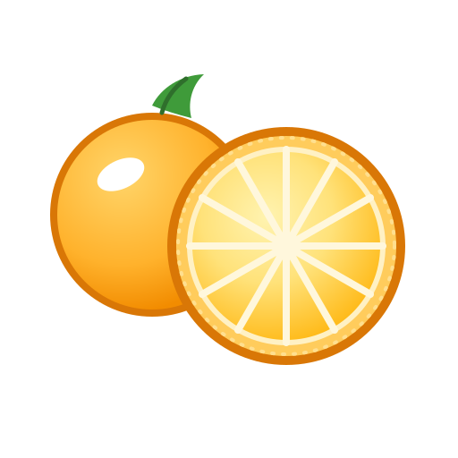

# Module 1 Activities: Citrus Observation and Catalogue Writing

## Resources

  
*Image: FruitStock*

<section>

### Observing Everyday Objects (Henderson, 2021)

Chapter 3, *‘Describing Familiar Objects’* (pp. 41–58), explores how careful observation can transform ordinary objects into interesting subjects for description. The chapter introduces practical techniques for noticing colour variation, surface texture, scent, and shape. It also demonstrates how short descriptive passages can highlight the distinctive qualities of everyday items such as fruits.

Access [Observing Everyday Objects](https://orangeuni.edu/library)

</section>

<section>

### Citrus Diversity and Characteristics (Delgado, 2022)

This chapter provides a short overview of citrus fruits and their distinctive characteristics. It explains how oranges, lemons, mandarins, and limes differ in flavour, acidity, aroma, and visual appearance. The chapter includes several examples showing how these characteristics can be translated into clear descriptive language.

Access [Citrus Diversity and Characteristics](https://orangeuni.edu/library)

</section>

<section>

### Writing Catalogue Entries (Marshall, 2020)

This article explores how catalogue entries are used in museums, botanical collections, and illustrated guides. The author explains how short descriptions and images are combined to communicate essential information clearly and efficiently. The examples demonstrate how concise writing can highlight the most distinctive features of an object.

Access [Writing Catalogue Entries](https://orangeuni.edu/library)

</section>

<section>

### Photographing Food and Natural Objects (Chen & Ibrahim, 2022)

This reading introduces basic techniques for photographing food and natural objects for documentation. The chapter discusses lighting, background selection, and composition, and shows how small adjustments can make an object easier to observe and describe. These techniques can help you produce clear images for your fruit catalogue.

Access [Photographing Food and Natural Objects](https://orangeuni.edu/library)

</section>

