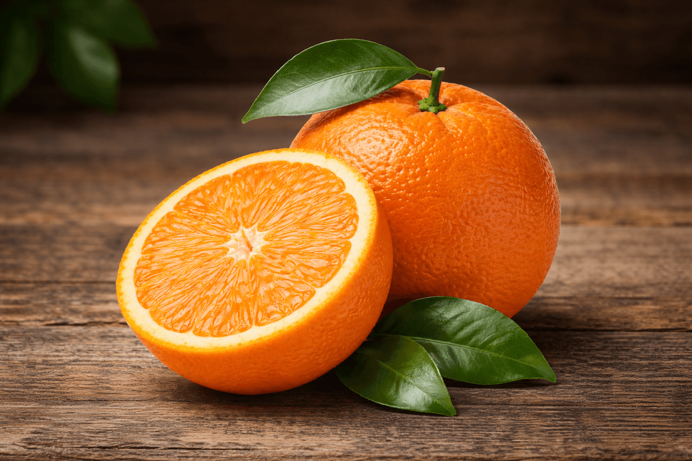

# Module 3: Citrus Observation, Description and Catalogue Design

*Image: FruitStock*

## The Orange

One of the most widely recognised citrus fruits, known for its bright colour and balanced sweet–tart flavour.

## Introduction

Welcome to Module 3. This module explores how fruits can be carefully observed, described, and organised into a simple catalogue format. Citrus fruits provide an excellent opportunity to practice observation skills because they combine distinctive colour, scent, texture, and flavour. The orange is a familiar example. While it may seem ordinary at first glance, closer observation reveals many interesting features: the textured skin, the segmented interior, the fine membranes separating each wedge, and the sharp burst of citrus aroma released when the peel is broken.

Botanists classify oranges within the genus *Citrus*, a group of fruits that includes lemons, limes, mandarins, and grapefruits (Delgado, 2022). These fruits share structural similarities, such as segmented flesh and aromatic oils in their skins, yet they vary widely in sweetness, acidity, and appearance. Observing these differences helps develop the ability to describe food clearly and accurately.

The orange also illustrates how sensory experiences combine to shape our perception of fruit. Its colour suggests freshness and sweetness, while the scent released from the peel is often stronger than the flavour itself. When eaten, the juicy interior delivers both sweetness and acidity, creating the refreshing taste that citrus fruits are known for (Harper & Singh, 2021).

In this module you will learn how to organise fruit observations into short catalogue entries. A catalogue entry typically combines a small image with a concise descriptive paragraph that highlights the most noticeable qualities of the fruit. This format is commonly used in field guides, botanical references, and food catalogues because it allows readers to quickly understand both the appearance and character of an item (Marshall, 2020).

You will also continue thinking about how images and written descriptions support one another. A photograph communicates visual qualities such as colour, shape, and texture, while written descriptions can capture sensory experiences—such as aroma, flavour, or texture -- that images alone cannot fully convey.

By the end of this module you should feel more confident organising your fruit observations into structured catalogue entries that combine descriptive writing and images. These skills will support your progress toward **Assessment 1**, where you will create a short fruit catalogue featuring three fruits of your choosing.

## Subject Learning Outcomes

This module will help you achieve the following outcomes:

- `=[[outline]].slo.a`
- `=[[outline]].slo.c`

## Assessment Progression

Assessment 1 is due at the end of **Module 4**.

Tasks to undertake in this module to prepare for Assessment 1 include:

- Read the **Assessment 1 Brief** carefully.
- Review the fruit observations you began collecting in earlier modules.
- Select at least **three fruits** that you might include in your catalogue.
- Write short descriptive notes about each fruit's appearance, scent, flavour, and texture.
- Locate or create suitable images for each fruit (photograph, sketch, or freely licensed illustration).
- Consider how the images and descriptions will be arranged in your catalogue document.
- Look at examples of simple catalogues or illustrated guides and notice how images and text are paired.

You can prepare for this assessment task by using the learning resources provided in this module. These resources include readings, visual examples, and small writing exercises designed to help you refine your observation and description skills.

If you would like to begin working on the assessment early, ensure that you have reviewed the assessment brief and understand the submission requirements before drafting your catalogue entries.

## References

<!-- maintain references in mod_01_resources.bib (BibTeX); the site build renders them in /build. -->

